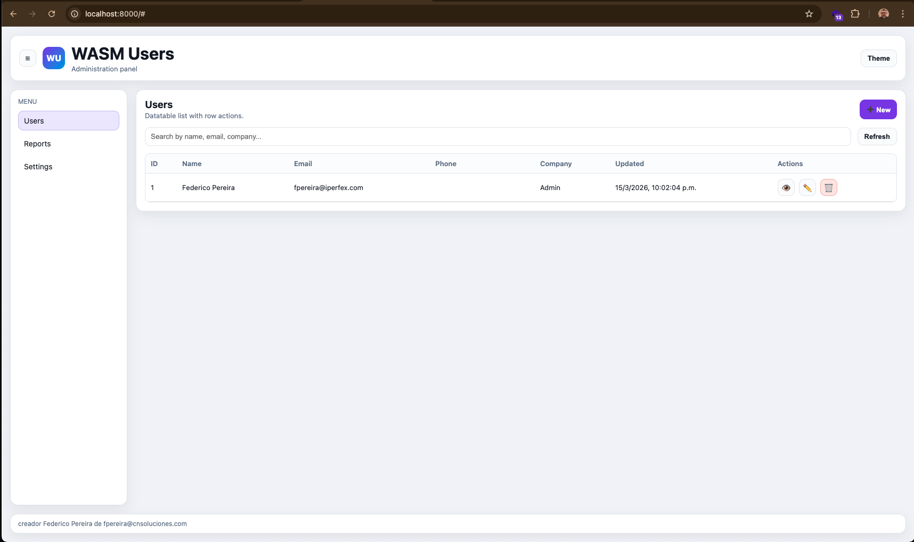
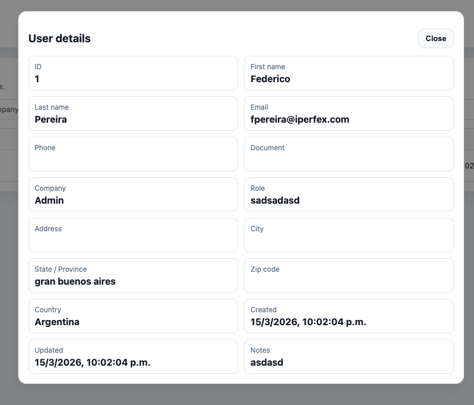
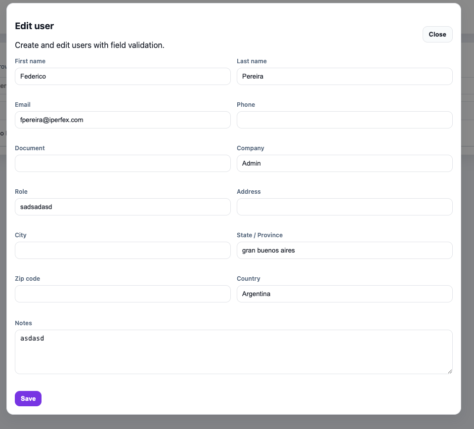

# Astro + Go WASM Users CRUD (Demo)

[English](README.md) | [Español](README.es.md)

<p>
  
  
  
</p>

Este repositorio es una **demo** que muestra cómo correr un “servidor API local” dentro del navegador usando:

- **Astro** (UI)
- **Go WebAssembly** + **Service Worker**
- [`go-wasm-http-server`](https://github.com/nlepage/go-wasm-http-server) (handlers HTTP dentro de un Service Worker)
- **IndexedDB** (persistencia local)

El resultado es un **CRUD de usuarios** donde requests como `GET /api/users` son atendidas por Go WASM dentro del Service Worker.

## Requisitos

- **Node.js** 20+
- **Go** 1.22+

## Instalar

```bash
make install
```

## Compilar todo

```bash
make all
```

Esto hace:

- Build del frontend Astro (`dist/`)
- Build del servidor WASM (`public/server.wasm`)
- Copia el runtime de Go (`public/wasm_exec.js`)

## Ejecutar la demo (servidor estático)

```bash
make serve
```

Luego abrir `http://localhost:8000/`.

## API (servida por Go WASM)

- `GET /api/users`
- `GET /api/users/{id}`
- `POST /api/users`
- `PUT /api/users/{id}`
- `DELETE /api/users/{id}`

## Validación y errores

La validación ocurre en:

- el **frontend** (UX)
- el **backend WASM** (API autoritativa)
- la **capa de IndexedDB** (restricciones únicas para email/documento)

Ejemplo de error de la API:

```json
{
  "ok": false,
  "message": "validation_failed",
  "errors": {
    "firstName": "First name is required",
    "email": "Invalid email"
  }
}
```

