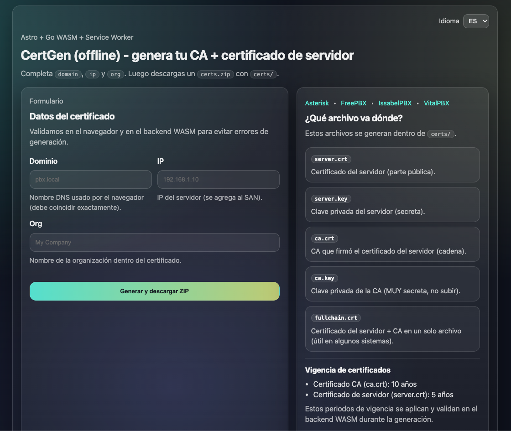
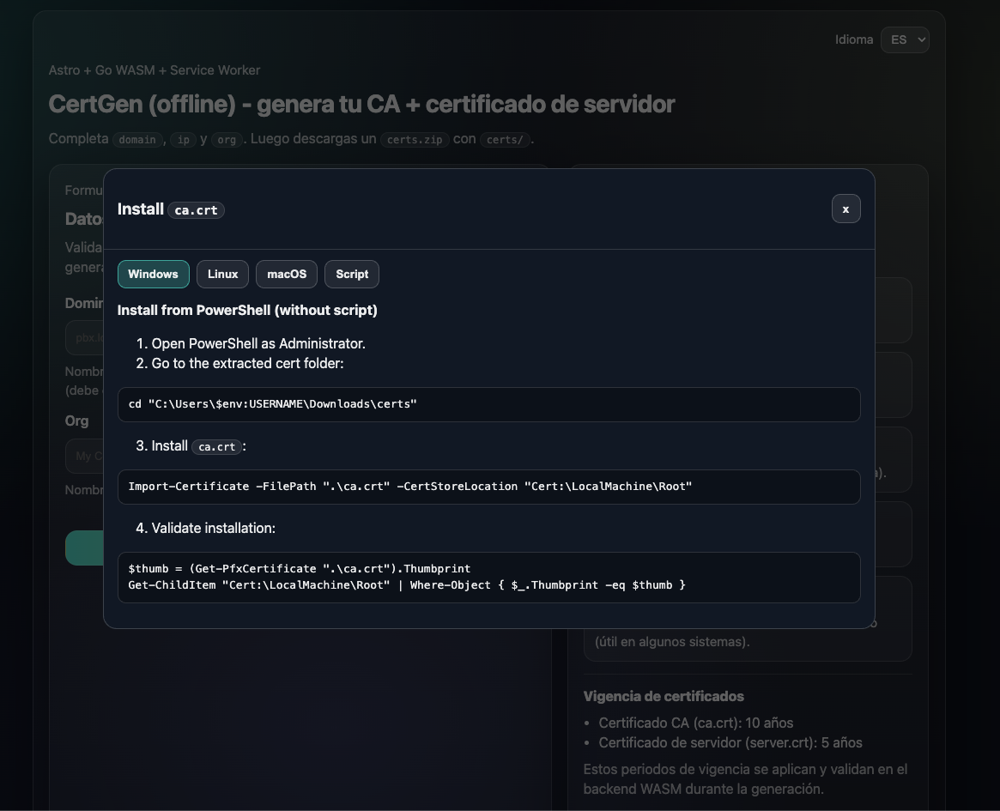

# certgen-wasm-server

[English](README.md) | [Español](README.es.md)

Generate internal TLS certificates directly in the browser using **Astro + Go WASM + Service Worker**.

> The prototype was removed. This repository now contains only the WASM implementation.

## What this project does

The web form asks for:

- `domain`
- `ip`
- `org`

Then the WASM backend generates and downloads a ZIP file with:

```text
certs/
  ca.crt
  ca.key
  server.crt
  server.key
  fullchain.crt
  install_ca_cert.sh
```

## Certificate validity

- `ca.crt` (CA certificate): **10 years**
- `server.crt` (server certificate): **5 years**

These validity periods are applied in the WASM backend during generation.

## Supported PBX targets

- Asterisk
- FreePBX
- IssabelPBX
- VitalPBX

Generic field mapping:

- **Certificate** -> `server.crt`
- **Key** -> `server.key`
- **Chain** -> `ca.crt`

## UI screenshots

Main panel:



Install modal:



## Tech stack

- Astro (static frontend)
- Go (`GOOS=js GOARCH=wasm`) for certificate generation
- [`go-wasm-http-server`](https://github.com/nlepage/go-wasm-http-server) in Service Worker

## Project structure (current)

```text
cmd/wasm-server/main.go
internal/certgen/
internal/validation/
pkg/ziputil/
public/
src/
```

## Requirements

- Go 1.22+ (you are using newer, also fine)
- Node.js 20+
- npm

## Build and run

```bash
make all
make serve
```

Open:

- [http://127.0.0.1:8000](http://127.0.0.1:8000)
- or [http://localhost:8000](http://localhost:8000)

## Language support in UI

The panel supports:

- English (default)
- Spanish
- Portuguese

## Security notes

- `ca.key` is highly sensitive (root CA private key).
- `server.key` is sensitive too.
- Never commit or share private keys in public repositories.

